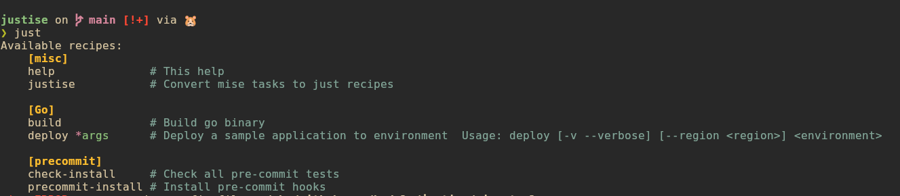

# justise


`just` is super simple for listing tasks, and I use it as the entry point to a
project. `mise` handles:

- packages to install
- secrets
- tasks

The issue: the `mise` tasks help output is not (yet) customizable by the author
([discussion](https://github.com/jdx/mise/discussions/8566#discussioncomment-16123193)).

`justise` therefore converts `mise` tasks into `just` recipes so they can be
listed by group with `just -l`.

## Configuration

### just tasks

```just
#!/usr/bin/env just -f

import? "justfile.mise"

# This help
[group('misc')]
@help:
    [ -f justfile.mise ] || just justise
    just -l -u

# Convert mise tasks to just recipes
[group('misc')]
@justise:
    mise run justise
```

### mise tasks

```toml
[tools]
"go:github.com/badele/justise" = "latest"
just = "latest"

[tasks.justise]
description = "Convert mise to just recipe"
hide = true
silent = true
run = '''
go run .
'''
```

## Usage

On the first run of `just -l`, the conversion from `mise` recipes to `just`
happens automatically.

You can also run the conversion manually:

```bash
just justise
```


